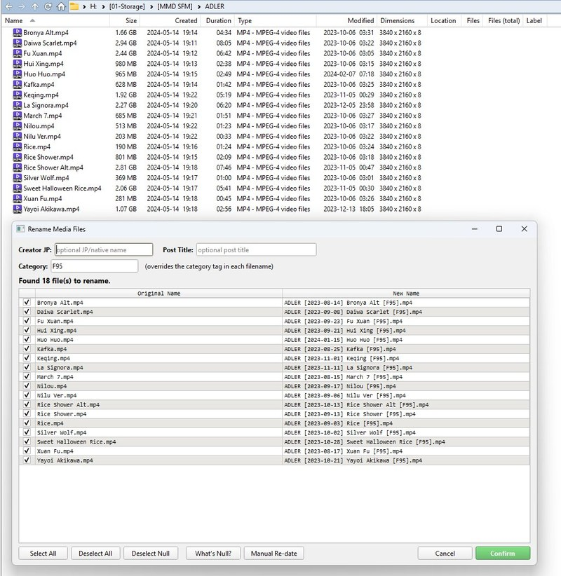
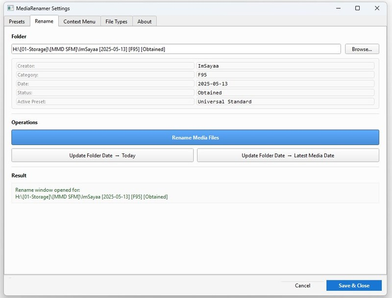
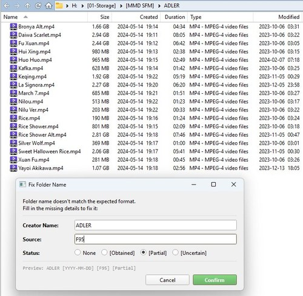
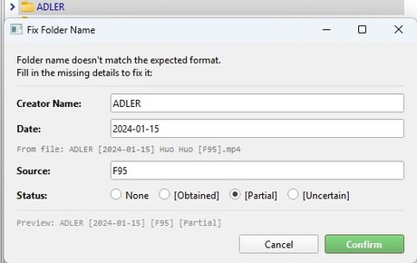
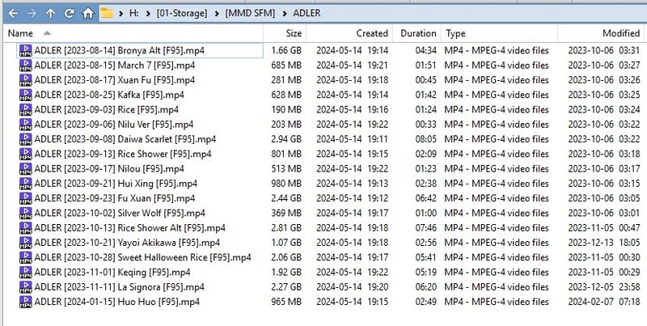
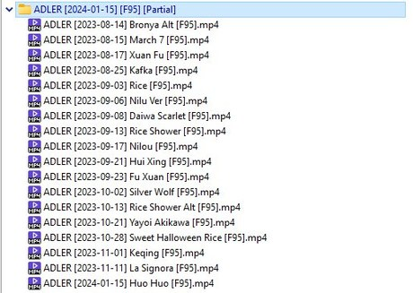

# Media Date Renamer

**Rename your media files and creator folders the right way — automatically.**


<!-- Replace with actual screenshot before publishing -->

---

## The Problem

If you download content from creators — videos, artwork, photos — you end up with filenames like `54 comiss.mp4` or `IMG_20240301_112233.jpg`. Nothing tells you who made it, when it was posted, or where it came from. Finding anything later is a mess.

The right fix is a consistent naming format: `Creator [Date] Filename [Source].ext`. But doing this by hand takes forever. And if you use gallery-dl, the files already have some of this — but the naming is still inconsistent, and the folder dates go stale the moment you add new files.

Media Date Renamer does all of it automatically. It reads the real creation date from inside the file — not the unreliable file system date — and renames everything in one click. Creator folders get updated too, so you can see at a glance when each creator was last active.

---

## What You Get

- **Correct dates, not filesystem dates.** Reads the actual creation date embedded in the video or image file. Works for `.mp4`, `.mov`, `.mkv`, `.jpg`, `.png`, `.webp`, `.heic`, and more.
- **Clean filenames in one click.** Files go from `54 comiss.mp4` to `Exga [2024-03-01] 54 comiss [F95].mp4` automatically.
- **Creator prefix auto-removed.** If the filename already starts with the creator's name (common with gallery-dl), it gets stripped so you don't get `Exga [2024-03-01] Exga 54 comiss [F95].mp4`.
- **Folder dates always current.** Update a folder's date to today or to the most recent file inside it. Just by looking at folder names, you can see which creators have new content and which don't.
- **Preview before you commit.** A rename window shows you every planned change before anything is touched. Files with no readable date are highlighted in orange so you can decide what to do with them.
- **Right-click, done.** Works directly from Windows Explorer. No extra windows to open.

---

## Install

### 1. Install Python

Download from [python.org](https://www.python.org/downloads/). During install, **tick "Add Python to PATH"** before clicking Install Now.

Verify it worked: open Command Prompt and run `python --version`.

### 2. Install dependencies

Double-click `install_dependencies.bat`.

This installs everything the tool needs: PyQt6, pymediainfo (includes the video reading library), Pillow, and pillow-heif.

### 3. Register the right-click menu

Right-click `install.bat` → **Run as administrator**.

This adds the context menu entries to Windows. If you ever move the folder, run this again to update the paths.

---

## How to Use

### Rename files in a creator folder

Right-click **inside** the folder (on empty space) → **Rename Media Files**.

**Settings panel — Rename tab**



A preview window opens showing every planned rename. Files with no readable date are shown in orange.

**Rename preview window — review every planned rename before confirming**


Use the buttons at the top to control what gets renamed:

| Button | What it does |
|---|---|
| Deselect Null | Unchecks all orange files (no readable date) |
| What's Null? | Explains how dates are determined |
| Manual Re-date | Lets you type in a date for all selected files |

Click **Confirm** when ready. Nothing is renamed until you confirm.

### Update a folder's date

Right-click **on** a creator folder → choose one of the Update Folder Date options.

If the folder name doesn't match the expected format, a dialog appears to fill in the missing details. When available, the date is detected automatically from the files inside.

<table>
<tr>
<td></td>
<td></td>
</tr>
</table>

### Before and after

<table>
<tr>
<td></td>
</tr>
<tr>
<td></td>
</tr>
</table>

### Settings

Double-click `open_settings.bat` to open the settings panel. From here you can:

- Create and switch between naming presets
- Configure which file types are included
- Customize context menu labels and order
- Run any operation directly from a folder browser

---

## Naming Format

The default **Universal Standard** preset:

```
# File
Creator CreatorJP [YYYY-MM-DD] Post Title - OriginalFilename [Source].ext

# Folder
Creator CreatorJP [YYYY-MM-DD] [Source]
Creator CreatorJP [YYYY-MM-DD] [Source] [Status]
```

Optional fields (`CreatorJP`, `Post Title`) collapse cleanly when blank — no double spaces or stray dashes.

Folder status options:

| Status | Meaning |
|---|---|
| Obtained | Everything obtained up to the latest date. Nothing missing except intentional deletions. |
| Partial | Missing some content that wasn't intentionally deleted. |
| Uncertain | Collection state unknown. |

---

## Known Limitations

| Limitation | Details |
|---|---|
| Windows only | Registry integration, UAC elevation, Windows paths |
| HEIC support optional | Requires `pillow-heif`. If install fails, HEIC files are skipped but everything else works. |
| No embedded date = null | Files with no metadata date show as `[null]`. Use Manual Re-date to assign one. |

---

## Troubleshooting

**Nothing happens on right-click** — Re-run `install.bat` as administrator. If you moved the folder, run it again to update paths.

**"Python is not recognized"** — Reinstall Python and tick "Add Python to PATH". Restart any open terminals.

**All dates show as null** — The file has no embedded date. Check if the filename contains a date; otherwise use Manual Re-date.

**"Failed to rename folder"** — A file inside is open in another program. Close it and retry.

---

## Uninstall

Right-click `uninstall.bat` → **Run as administrator**.

Removes only the registry entries. Python and your files are untouched.

---

## TL;DR for Monke

- Downloads give you messy filenames with no useful info
- This tool renames them using the real date inside the file
- Right-click inside a folder → Rename Media Files → preview → confirm
- Orange files have no readable date — skip them, or type in a date manually
- Right-click on a folder → update its date to today or to the newest file inside
- Settings panel for presets, file types, context menu order
- Run `install_dependencies.bat` → `install.bat` (as admin) → done
- No separate video library to install — it's all included
